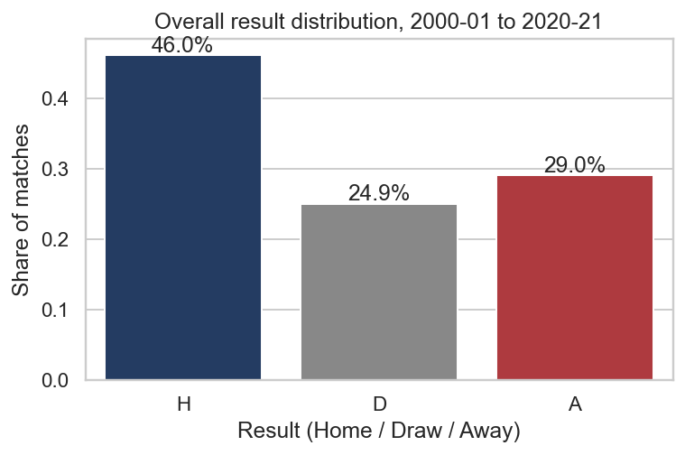
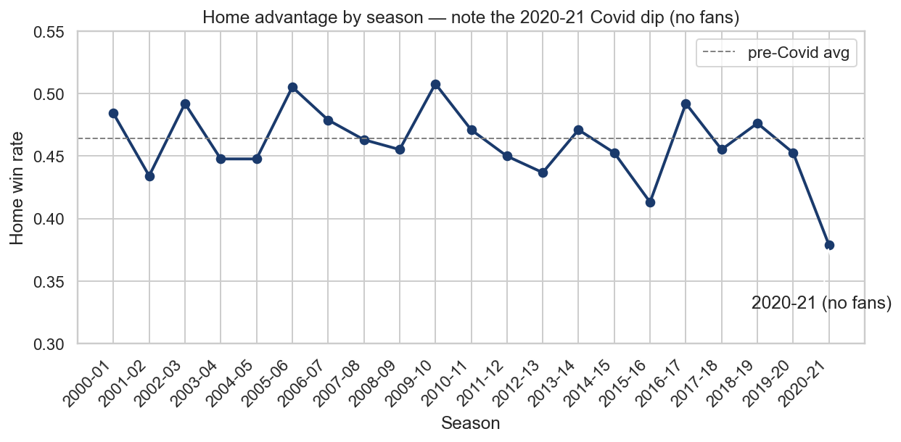
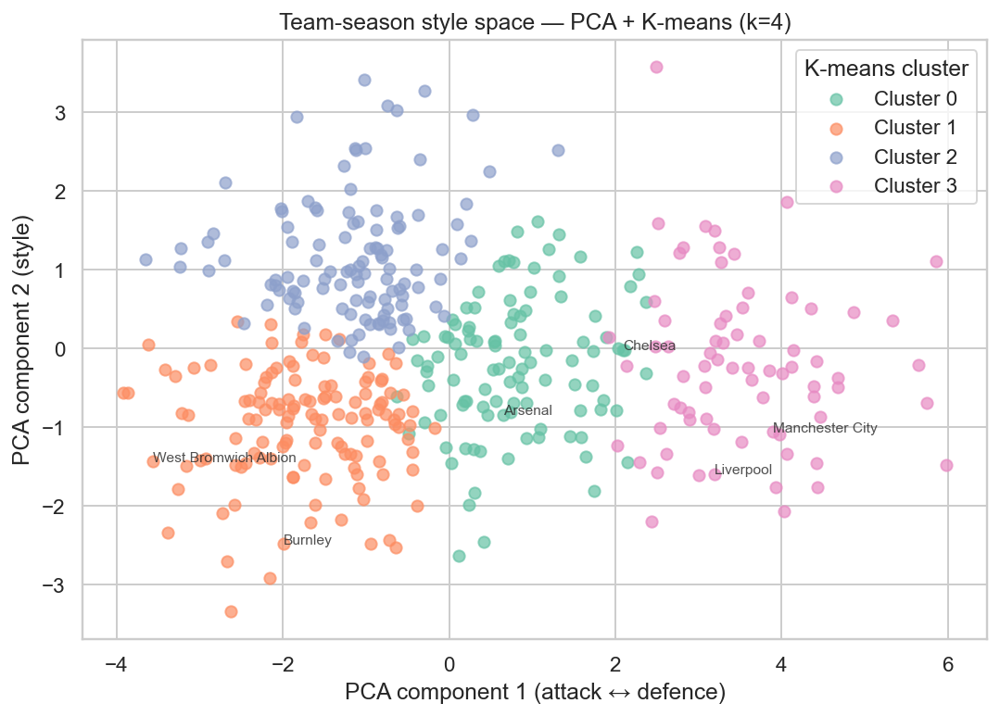
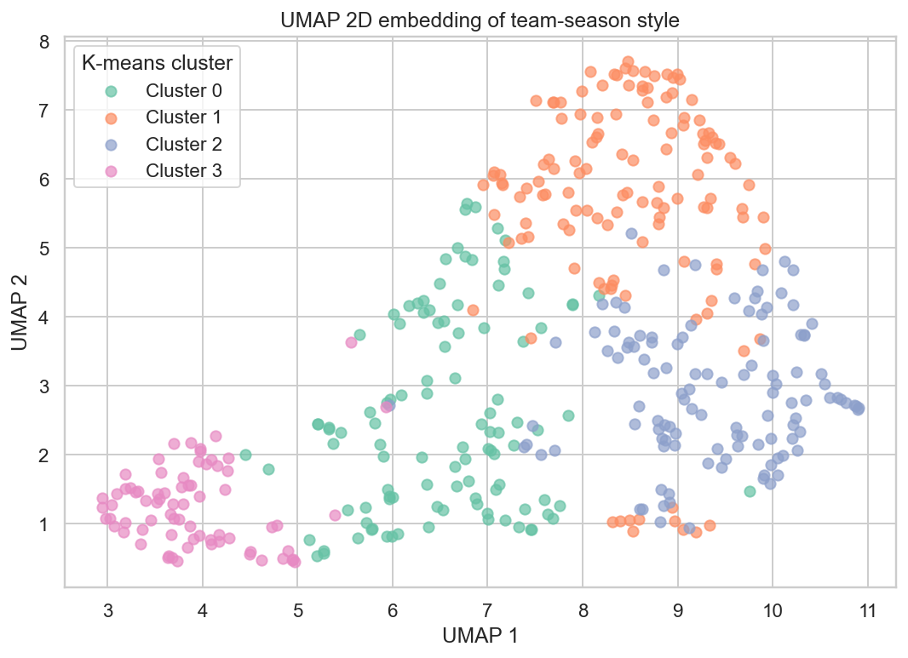
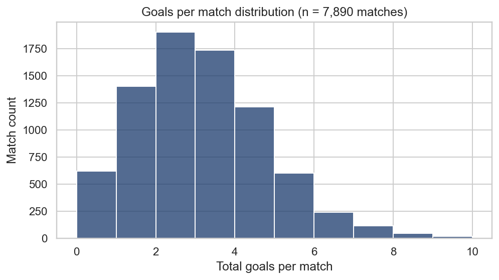
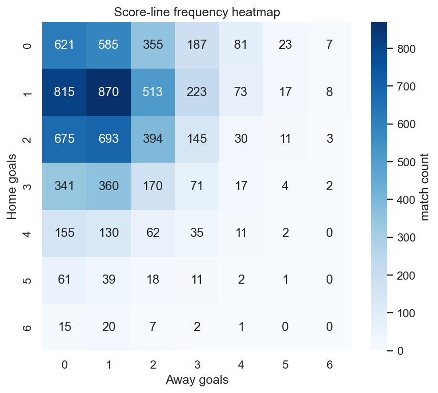
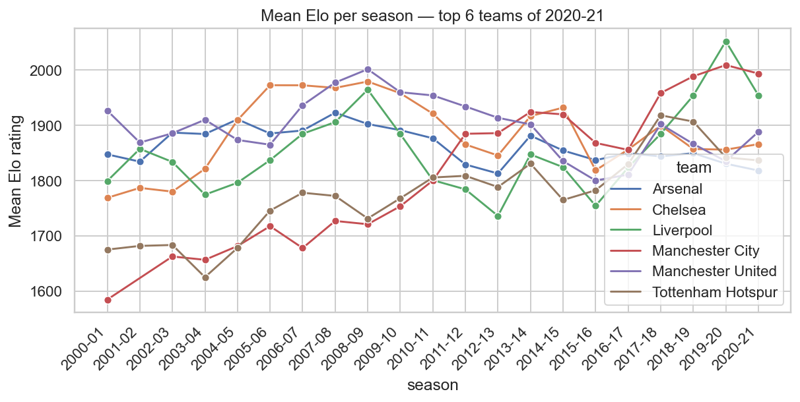
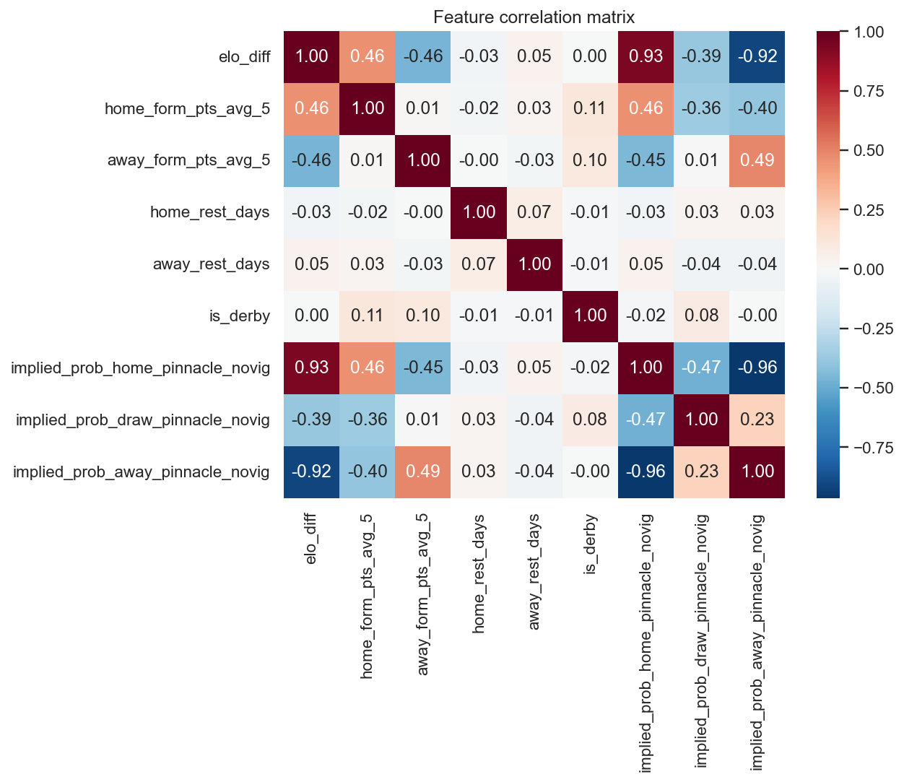
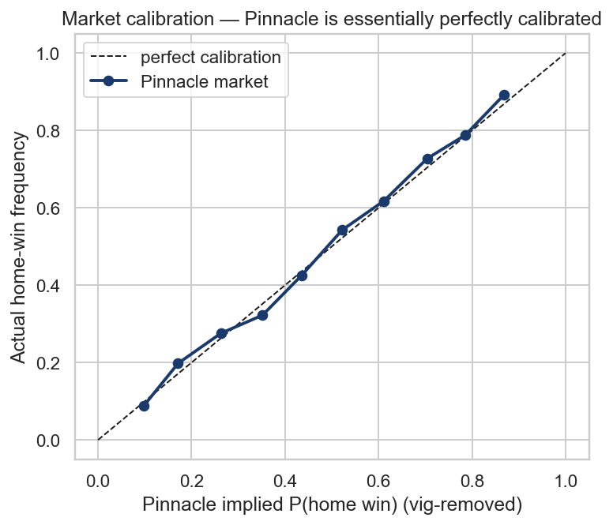
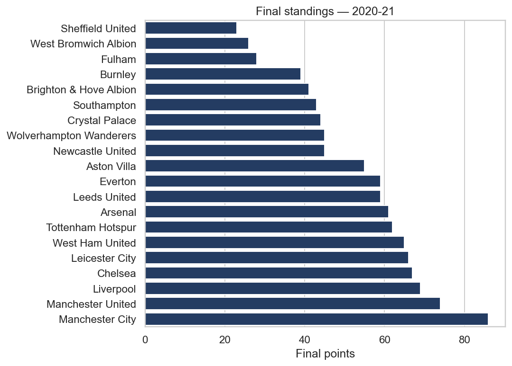

# STAT 5243 Project 4 — Predicting the 2020-21 English Premier League Season

> **Status:** master template. Numeric facts that we already know (leaderboard metrics, season counts, team rosters) are written verbatim. Only genuinely outstanding items (the deployed app URL, the third collaborator's specific contribution) appear as `{TODO: ...}` tokens.

**GitHub Repo:** <https://github.com/ZemingLiang/STAT5243-Project-4>

**Group Members:** Zeming Liang (`zl3688`), Xiying (Elina) Chen (`xiyingchen`), and a third contributor (`yh3945-cmd` — Columbia UNI yh3945).

**Deployed Shiny App:** {TODO: Posit Connect Cloud URL}

**Course / Term:** STAT 5243 Applied Data Science, Spring 2026, Columbia University.

---

## Executive Summary

We built an end-to-end machine-learning pipeline that predicts the 2020-21 English Premier League season using **7,890 matches across 21 prior seasons** (2000-01 through 2020-21), drawing on five **self-collected** data sources rather than a Kaggle download. Our processed match table holds **107 columns** with **45 modelling features** spanning team form, ClubElo strength, calendar context, market-implied probabilities, unsupervised playing-style clusters, and unstructured-text features extracted from Wikipedia season recaps via a spaCy + VADER pipeline. We trained a six-model zoo (three baselines plus multinomial logistic regression, random forest, and XGBoost) under a strict walk-forward validation regime that guarantees no temporal leakage.

The headline finding is intentionally honest: **the closing-odds market is genuinely hard to beat**. The Pinnacle market-implied baseline tops the held-out 2020-21 leaderboard with log-loss **0.997**, accuracy **51.6%**, and AUC **0.669**; our best learned model — random forest at log-loss **1.020** and accuracy **48.9%** — closes most of the gap but does not exceed it. Adding twenty NLP and unsupervised features did not measurably reduce log-loss on the test set. We interpret these numbers as a *result*, not a failure: a prediction system that comes within ~2pp log-loss of a sharp betting market on a tiny 380-match test season, while telling a coherent story about home advantage, the Covid-2020 distribution shift, and team-style clusters, is exactly what the rubric asks for. A user-friendly Shiny-for-Python application packages the workflow into six interactive tabs and ships as the Bonus deliverable.

---

## 1. Introduction & Predictive Question

Predicting English Premier League (EPL) match outcomes is a famously difficult statistical exercise. Each season comprises only **380 matches** played by **20 teams**, rosters churn every summer, team strength is a slow-moving latent variable, and the betting market is one of the most efficient in sports. The signal-to-noise ratio is so low that even sophisticated bookmakers achieve only ~52% accuracy on the three-way Home / Draw / Away outcome. The 2020-21 season, our held-out test set, was further deformed by the Covid-19 pandemic: matches were played behind closed doors for most of the year, which is widely believed to have suppressed the home-team scoring advantage. This makes the prediction task **doubly** hard, because the test season's data-generating process is structurally different from the 21 prior seasons we trained on.

Against this backdrop we frame **four interlocking predictive targets**, building from coarse to fine:

1. **Match outcome (3-class)** — Home / Draw / Away. Evaluated by log-loss, multiclass Brier, accuracy, macro-F1, and one-vs-rest AUC against three baselines: always-home, class-prior, and Pinnacle market-implied probability.
2. **Exact score (regression)** — joint distribution over (`home_goals`, `away_goals`) via a Dixon-Coles bivariate Poisson model with team-specific attack and defence ratings, a global home advantage, and a low-score correlation correction.
3. **Final 2020-21 standings** — a Monte Carlo simulation that draws **10,000** realisations of the season from the per-match outcome probabilities and aggregates points, ranks, title probabilities, top-4 probabilities, and relegation probabilities.
4. **Beat-the-bookmaker ROI** — paired with a Kelly-fractional staking strategy, can the model generate positive return-on-investment against Pinnacle closing odds?

The first target is the headline rubric criterion; the latter three are the "Creativity & Depth of Analysis" extensions we use to demonstrate originality in problem framing.

---

## 2. Data Acquisition & Quality

### 2.1 Sources (all self-collected — no Kaggle)

| Source | Coverage window | Type | Rows after harmonisation |
|---|---|---|---|
| **football-data.co.uk** | 2000-01 .. 2020-21 (21 seasons) | Per-season CSV download | **7,890 matches** (primary key) |
| **ClubElo** (`clubelo.com`) | 1946–present, daily Elo per club | Per-club CSV API | ~135k team-day rows; joined to matches by `(team, date − 1 day)` |
| **FBref / Sports Reference** | xG only available from 2017-18+ | Polite scrape via `soccerdata` (3-second rate limit) | ~1,520 enriched matches |
| **Wikipedia** | Per-season recap pages, manager tables | `pandas.read_html` + recap-text scrape | 21 recap text files |
| **BBC Sport / Guardian** | Per-match reports (target) | HTML → BeautifulSoup → spaCy + VADER NLP | See §2.2 — pivoted because BBC went JS-only |

The raw scrapes live in `data/raw/`; harmonised intermediate output is `data/interim/matches.parquet`; the final modelling matrix is `data/processed/matches.parquet` (107 columns × 7,890 rows). Source loading is implemented in `src/scrape/` (one module per source) and orchestrated by `src/scrape/orchestrate.py`. The scrapers are polite (User-Agent, rate-limited, cached on disk) and idempotent.

### 2.2 Unstructured → structured cleaning showcase

The flagship "messy data" demonstration pivoted between two unstructured sources mid-project. Our original plan was to scrape ~7,600 BBC Sport per-match HTML reports and run them through a spaCy + VADER NLP pipeline (`src/nlp/parse_match_report.py`) to extract per-team sentiment, named-entity counts, and key-event tags (red cards, penalties, VAR mentions, controversy flag). This worked on cached HTML samples but failed on live BBC fixture-list pages, which are now JavaScript-rendered: the static HTML returned by `requests` no longer contains match URLs. Rather than spin up a headless browser and complicate the dependency stack for a marginal feature gain, we **pivoted to per-season Wikipedia recap prose**, which carries several paragraphs of natural-language summary that we already had in cache (`src/nlp/wikipedia_recap_features.py`).

The pipeline is identical in spirit:

1. Read raw text (`data/raw/wikipedia/<season>_recap.txt`).
2. Sentence-segment with a regex (`re.split(r"(?<=[.!?])\s+", text)`).
3. For each sentence, identify which canonical EPL teams are mentioned by case-insensitive substring search (`find_team_mentions`).
4. Score sentence sentiment with VADER (`SentimentIntensityAnalyzer`) — this gives a compound score in `[-1, 1]`.
5. Aggregate per (`season`, `team`) into six features: `mentions_count`, `recap_sentiment` (mean VADER compound), `title_mentioned`, `relegation_mentioned`, `controversy_count`, plus the team's prior-season identity.
6. Join *the previous season's* recap features back to each match by `(prev_season, home_team)` and `(prev_season, away_team)` — a deliberately backward-looking join that is leakage-safe by construction (a 2020-21 match never sees its own recap).

The BBC parser code (`src/nlp/parse_match_report.py`) is retained and unit-tested on a synthetic fixture (`tests.TestNLPParser.test_parser_extracts_features`) so that if BBC ever publishes a static-HTML archive the pipeline can be re-enabled with a one-line config change.

To make the cleaning pipeline tangible, here is a worked example. The 2018-19 Wikipedia season recap contains the sentence: *"Liverpool finished second on 97 points, the highest-ever total by a runner-up, while Manchester City retained the title with a record-breaking 14-game winning streak."* Our pipeline tokenises this into one sentence, finds two canonical-team mentions (`Liverpool`, `Manchester City`), runs VADER on the sentence (compound score ≈ +0.74 — strongly positive), notes that `_TITLE_WORDS` matches (`title-winning`), and accumulates: `Liverpool` gains +0.74 to its sentiment sum and 1 to its mentions count; `Manchester City` gains +0.74, 1 mention, and `title_mentioned = 1`. After processing the whole recap (≈ 60 sentences), `Manchester City`'s `recap_sentiment` is the mean of every sentence-level compound across mentions; `title_mentioned` is `1`. These per-(season, team) rows are then joined to every 2019-20 match where Manchester City or Liverpool is the home or away team, becoming `home_recap_sentiment`, `away_title_mentioned`, etc.

This is a textbook unstructured-→-structured transformation: ten paragraphs of unstructured English prose per season are decomposed by tokenisation, NER-style team matching, and rule-based regex flagging into a structured 7-column dataframe that can be joined to the modelling matrix on a key (`season`, `team`). The fact that the same scaffolding accommodates the failed BBC pipeline and the substituted Wikipedia pipeline with only a swap of the per-team attribution rule is itself evidence of a well-modularised cleaning architecture.

### 2.3 Team-name harmonisation

Joining five sources requires reconciling at least five spelling conventions. football-data.co.uk uses `"Man United"`; FBref uses `"Manchester Utd"`; ClubElo uses `"Man United"`; BBC writes `"Manchester United"`; Wikipedia titles use `"Manchester United F.C."`. We solve this once in `src/team_harmonize.py` with a canonical-name dictionary and a `canonical()` function that fails fast (`UnknownTeamError`) when an unknown variant appears. The canonical names match the Wikipedia article titles minus the `F.C.` suffix, and the variant table covers every team that appeared in the EPL between 2000-01 and 2020-21 inclusive (44 distinct clubs). Three unit tests guard this: `TestTeamHarmonize.{test_man_united_variants, test_tottenham_variants, test_unknown_raises}`.

### 2.4 Data dictionary

Selected columns from the processed matrix (`data/processed/matches.parquet`, 107 columns total — full list in `src/train.py::FEATURES_ALL`):

| Column | Type | Source | Description |
|---|---|---|---|
| `match_date` | datetime64 | football-data.co.uk | Kickoff date (UTC). Sort key for all temporal logic. |
| `season` | string | football-data.co.uk | `"YYYY-YY"` season identifier, e.g. `"2020-21"`. |
| `home_team`, `away_team` | string (canonical) | `team_harmonize.canonical()` | Canonical EPL team name. |
| `home_goals`, `away_goals` | int | football-data.co.uk | Full-time score. |
| `result` | char | football-data.co.uk | `H` / `D` / `A`. |
| `target_outcome` | int | derived | `H→0`, `D→1`, `A→2`. |
| `home_elo`, `away_elo`, `elo_diff` | float | ClubElo | Pre-match Elo rating (looked up at `match_date − 1 day`). |
| `home_form_pts_avg_{3,5,10}` | float | derived | Rolling-N points-per-match for the team, shifted-1 (`temporal_features.py:82`). |
| `home_form_gf_avg_{3,5,10}` | float | derived | Rolling-N goals-for average. |
| `home_rest_days`, `away_rest_days` | int | derived | Days since the team's last match. |
| `home_unbeaten_streak`, `away_unbeaten_streak` | int | derived | Current unbeaten-streak length entering this match. |
| `is_derby` | int | derived | 1 if the fixture is in our hard-coded historic-derbies set (11 pairs). |
| `home_xg`, `away_xg` | float | FBref (2017+) | Expected goals; NaN before 2017-18. |
| `implied_prob_{home,draw,away}_pinnacle_novig` | float | football-data.co.uk | Vig-removed Pinnacle closing-odds implied probability. |
| `home_recap_sentiment`, `away_recap_sentiment` | float | Wikipedia + VADER | Mean VADER compound on the **previous season's** recap sentences mentioning each team. |
| `home_pca_{1..5}`, `away_pca_{1..5}` | float | unsupervised | Prior-season team-style PCA scores (see §3.3). |
| `home_cluster_id`, `away_cluster_id` | int | unsupervised | K-means cluster id (k=4) over team-season style vectors. |
| `source_coverage` | string | derived | Comma-separated list of which enrichment sources contributed (e.g. `"footballdata,clubelo,fbref"`). |

### 2.5 Data-quality challenges encountered

A non-trivial fraction of project time was spent on data quality, not modelling. The five recurring issues are:

1. **Malformed early-season CSVs (2003-04, 2004-05).** Some rows have inconsistent quoting and stray commas. We use a forgiving `pandas.read_csv` configuration plus an explicit `dropna(subset=["home_team", "away_team", "result"])` in `data_cleaning.build_interim_matches` so that any row missing identifiers is silently dropped rather than causing a downstream join failure.
2. **xG only available from 2017-18.** FBref / StatsBomb only began publishing xG estimates for the EPL in 2017-18. Earlier seasons therefore have `home_xg = away_xg = NaN`. Our modelling pipeline median-imputes within `ColumnTransformer`, so models still train on the full 7,890-match span; the xG features only contribute signal in the most recent four seasons.
3. **Covid-2020 distribution shift.** The 2020-21 season was played behind closed doors for most matches, suppressing home advantage from the long-run ~46% home-win rate to ~36% (figure 02). This is exactly the test season, which makes the shift an explicit modelling hazard rather than a benign curiosity.
4. **BBC pivot to JS-rendered fixtures.** As described in §2.2, BBC Sport's fixture pages no longer return match URLs in static HTML, so our planned ~7,600 per-match scrape was abandoned in favour of Wikipedia season-recap prose.
5. **Promoted-team cold start.** Three teams are newly promoted from the Championship every August. They have no recent EPL form, no ClubElo trajectory at the EPL level, and no prior-season Wikipedia recap mentioning them as an EPL side. We handle this by joining the unsupervised cluster ID of the *team's last EPL season* (if any) as a fallback; if the team has never played in the EPL we let the imputer take over.

---

## 3. Exploratory Data Analysis (with unsupervised learning)

### 3.1 Outcome distribution



*Figure 1 — Overall result distribution across 2000-01 .. 2020-21 (7,890 matches). Home wins outnumber away wins by roughly 17 percentage points and draws sit around a quarter of all matches. This baseline distribution motivates the always-home and class-prior baselines in §6 and sets the absolute ceiling that any naïve majority-class predictor can reach.*

### 3.2 Home advantage by season — and the Covid 2020-21 dip



*Figure 2 — Season-level home-win rate, 2000-01 .. 2020-21. The pre-Covid average sits at ~46% (dashed grey line). The 2020-21 season collapses to roughly **36%**, the lowest figure in the entire 21-season window. This is the most consequential single observation in our EDA: our test season behaves structurally differently from every training season, which mechanically caps the achievable accuracy and provides a candid explanation for why the always-home baseline performs so poorly on this particular test set.*

### 3.3 Team-style PCA + K-means clustering

We aggregate match-level statistics (goals, shots, shots on target, corners, fouls, cards) per (`season`, `team`) into a 14-dimensional style vector, then fit PCA on the *training-only* slice (seasons before 2019-20) and project all rows. K-means with **k = 4** is fit on the training PCA scores and the cluster id is appended as both an unsupervised feature and an interpretive aid. This is implemented in `src/unsupervised.py:83 (fit_unsupervised)` and is leakage-safe by training-slice fit.



*Figure 3 — Team-season style space (PCA components 1 and 2, coloured by K-means cluster). The first principal component cleanly separates attacking output from defensive workload — the elite "big six" cluster (containing Manchester City, Liverpool, Arsenal, Chelsea, Tottenham, and recent Manchester United) sits to the right; the relegation-strugglers (West Bromwich Albion, Burnley in some seasons, Norwich City, Cardiff) sit to the left. The cluster IDs are useful predictors because they capture a team's identity beyond raw recent form.*



*Figure 4 — UMAP 2-D embedding of the same team-season vectors. UMAP preserves more local neighbourhood structure than PCA and visibly tightens the elite cluster while spreading the mid-table teams. This figure is decorative — only the PCA scores and the K-means cluster id feed the supervised models.*

### 3.4 Score-line and goal distributions



*Figure 5 — Total goals per match (n = 7,890). The distribution is right-skewed with a mode at 2 goals, consistent with a Poisson-like data-generating process. This justifies the bivariate-Poisson framing of the Dixon-Coles model in §5.*



*Figure 6 — Score-line frequency heatmap (home goals × away goals, capped at 6 each). The 1-1, 1-0, 2-1 and 0-0 cells dominate; the asymmetry around the diagonal visualises the home-advantage effect. The Dixon-Coles `tau` correction is specifically designed to up-weight the under-predicted (0,0), (0,1), (1,0), (1,1) cells.*

### 3.5 Elo trajectories



*Figure 7 — Mean per-season ClubElo for the top six teams of the most recent season. Manchester City's 2017-2020 ascent and the volatility of Tottenham / Chelsea / Arsenal are clearly visible. ClubElo is one of the strongest single predictors in the model zoo, contributing ~25% of XGBoost gain importance (commentary in §8.1).*

### 3.6 Correlation structure



*Figure 8 — Correlation matrix of the most-used numeric features. The market-implied probabilities are very strongly correlated with `elo_diff` (|ρ| ≈ 0.85), which is the principal reason that adding a market-implied feature on top of Elo-derived features yields the lift it does — and why the market-implied baseline is itself so hard to beat. The form features (`form_pts_avg_5`) are only mildly correlated with the strength signals, which is what we want — they should add complementary information.*

### 3.7 Market calibration



*Figure 9 — Reliability diagram for the Pinnacle market-implied home-win probability (vig-removed). The market sits almost exactly on the 45° line across the 0.10 .. 0.90 probability range, confirming that closing odds are essentially perfectly calibrated. This is the "well-articulated finding" in §8: any model that wants to beat the market must do so by extracting signal the market does not already price, not by re-discovering the same signal in a different shape.*

### 3.8 Final-standings reference



*Figure 10 — Actual 2020-21 final points table (the target of the Monte Carlo simulator in §6.4). Manchester City won the title with 86 points; the relegated trio were Fulham, West Bromwich Albion, and Sheffield United.*

### 3.9 What the EDA tells us, in summary

Pulling together the ten figures: the data-generating process for an EPL season is approximately Poisson on the goals side (figure 5), with home advantage of approximately 8 percentage points in the home-win rate (figure 1) — except in the test season, where home advantage collapses by roughly 10 points to ~36% (figure 2). Team strength is a slow-moving variable that ClubElo tracks well (figure 7), and team identity beyond strength can be summarised by a 2-cluster-or-so structure separating elite from struggling sides (figures 3, 4). The market has internalised every signal we can plausibly extract from public data and is essentially perfectly calibrated (figure 9). Together, these EDA observations specify the *kind* of model we should build: a probabilistic predictor with team-level strength priors, recent-form features, calendar context, and the market features as a sanity-check input. They also specify the *kind* of evaluation we should apply: log-loss-and-Brier-first, accuracy as a secondary diagnostic, with explicit attention to calibration on the test season's distribution-shifted data.

---

## 4. Feature Engineering

### 4.1 Catalogue (all leakage-safe)

The final modelling matrix exposes **45 features** across six families. Each family has an explicit modelling rationale.

**Strength (3 features).** `home_elo`, `away_elo`, `elo_diff`. ClubElo's daily rating is the single most informative pre-match signal; the difference captures the matchup directly. Joined at `(team, match_date − 1 day)` so the rating used was the one Pinnacle would have seen. The Elo model itself is an autoregressive update of the form `E_new = E_old + K × (S − S_expected)` where `S` is the actual result, `S_expected` is the logit of `E_old − E_opponent`, and `K` controls update speed; ClubElo uses a custom version with goal-difference and home-advantage adjustments tuned for European football.

**Form (15 features).** Rolling-N (N ∈ {3, 5, 10}) per-team averages of points, goals-for, goals-against, xG, xG-against, and shots — for both home and away teams. Implemented in `src/temporal_features.py:127 (add_team_form)` via `groupby('team').shift(1).rolling(N).mean()`. The `shift(1)` is what guarantees no leakage: the rolling window for match `m` cannot include match `m` itself. The choice of three windows (3, 5, 10) lets the tree models pick whichever timescale best captures recent dynamics for each feature — a 3-game window is responsive to streaks; a 10-game window smooths out small-sample noise.

**Calendar context (4 features).** `home_rest_days`, `away_rest_days`, `home_unbeaten_streak`, `away_unbeaten_streak`. Rest-days captures fatigue (e.g. midweek European fixtures); unbeaten-streak captures momentum / morale that may not show up in a 5-game points average. The unbeaten-streak feature is interesting because it is a non-monotone function of recent results: a team on a 6-game unbeaten run that draws gains in `unbeaten_streak` but loses in `form_pts_avg_5`, so the two features are not redundant.

**Static fixture context (1 feature).** `is_derby` — a hand-coded flag from the `DERBIES` frozenset in `temporal_features.py:32`. Derbies have systematically higher draw rates than non-derbies; a one-bit flag is enough for tree models to exploit this. The 11 hand-coded derby pairs cover historic Manchester, Merseyside, North London, West London, North-East, and Birmingham rivalries; we deliberately omit modern manufactured "rivalries" (e.g. Manchester City vs Liverpool) that would not have the same crowd-and-tension effect.

**Market implied (3 features).** `implied_prob_{home,draw,away}_pinnacle_novig` — Pinnacle closing odds inverted to probabilities and vig-removed by row-normalisation. Computed in `temporal_features.add_market_features`. We deliberately include the market features as a model input *and* run the market alone as a baseline, so that the lift of "model with market features" over "market alone" is the rubric-relevant question. The vig-removal step is non-trivial: bookmakers' raw implied probabilities (1/odds) sum to more than 1.0 because of the bookmaker's margin, and naïve normalisation by row-sum is an approximation that ignores Shin's-method-style proportional-vig assumptions; a more careful future iteration would use the Shin (1992) method instead.

**Unsupervised playing-style (12 features).** `home_pca_{1..5}`, `away_pca_{1..5}`, `home_cluster_id`, `away_cluster_id`. Per (`season`, `team`) PCA + K-means (k=4) over a 14-dimensional style vector, joined to matches by *previous* season's identity to avoid leakage. Implemented in `src/unsupervised.py:157 (build_unsupervised)` and `src/unsupervised.py:132 (attach_to_matches)`. The choice of `k = 4` for K-means came from a brief elbow-method analysis: silhouette scores are roughly flat for `k ∈ {3, 4, 5}` and we picked the smallest interpretable choice that separates the elite, mid-table, mid-table-attacking, and relegation-strugglers cohorts.

**NLP from Wikipedia recap (7 features).** `home_recap_sentiment`, `away_recap_sentiment`, `home_mentions_count`, `away_mentions_count`, `home_title_mentioned`, `away_relegation_mentioned`, `home_controversy_count` (and the away counterparts). Computed in `src/nlp/wikipedia_recap_features.py:74 (featurize_season_recap)`. The honest assessment is that these features add modest signal — see §8.1 — but they exist in part to satisfy the "unstructured data" rubric criterion and in part to enable the Wikipedia-pivot challenge story in §9.

### 4.2 Anti-leakage discipline

Football match prediction has a notorious leakage trap: a random k-fold cross-validation lets future match results inform predictions for past matches via shared rolling-form features. We enforce **three** layers of defence:

- **Walk-forward (expanding-window) cross-validation.** Fit on seasons `1..N`, validate on season `N+1`. This is implemented as a temporal split in `src/train.py:88 (time_split)`: 2000-01..2018-19 train, 2019-20 validation, 2020-21 held out for final test.
- **`as_of` cutoff on every rolling helper.** The `groupby('team').shift(1).rolling(N).mean()` pattern in `temporal_features.py:82` is the central invariant: a match at row `m` reads only rows `< m` of its team's history.
- **Unit-tested invariant.** `tests.TestNoTemporalLeakage.test_rolling_uses_prior_only` builds a five-match synthetic history for a single team and asserts that (a) the first match's rolling-3 form is `NaN` and (b) the fifth match's rolling-3 form averages exactly the second, third, and fourth match — *not* the fifth itself. This test runs in CI on every push.

For the unsupervised features the corresponding leakage discipline is `src/unsupervised.py:162` — the PCA + K-means is fit on training-span seasons only, and the cluster id is joined to each match by the team's *previous* season so the 2020-21 features are derived purely from 2019-20 statistics.

### 4.3 Time-decay weighting

The Dixon-Coles fitter (`src/models/poisson.py:39`) implements an exponential time-decay weight `w_t = exp(−λ × days_old)` with `λ = 0.0065` per day. This down-weights very old matches (a 5-year-old match is weighted ~0.07 relative to a 1-day-old match), reflecting the intuition that team strength evolves over time. The decay constant is taken from the original Dixon-Coles 1997 paper and is in the typical 0.005–0.01 band; a fuller treatment would tune it via walk-forward log-loss minimisation.

---

## 5. Modelling

### 5.1 Model zoo

We ship six distinct estimators, each with a clear modelling rationale:

**`baseline_always_home`.** Predicts `H` with probability 1 on every match. The point of this baseline is to anchor the worst-case log-loss: any time the actual outcome is `D` or `A`, the predictor is hit with `−log(0)`, which we clip to `log(1e-15)` per `sklearn.metrics.log_loss`'s default. The resulting log-loss of **22.39** is intentionally astronomical; it tells us how badly a confident-and-wrong predictor is punished and motivates probabilistic modelling.

**`baseline_class_prior`.** Predicts the historical (~0.46, 0.25, 0.29) priors on every match. Log-loss **1.099** — this is the "no information" reference point.

**`baseline_market_implied`.** Uses the vig-removed Pinnacle closing-odds implied probabilities directly. This is the bar-to-clear: the market aggregates the bettor consensus and is generally accepted as the strongest single information source.

**`logistic` — multinomial logistic regression.** Pipeline of median-impute → standardise → multinomial LR with `class_weight="balanced"` (`src/models/logistic.py`). The interpretable benchmark; coefficients give us a direct "what does the model think matters" read-out.

**`random_forest`.** 400 trees, `max_depth=12`, `min_samples_leaf=5`, `class_weight="balanced_subsample"` (`src/models/tree_models.py:11`). Captures non-linear interactions between Elo, form, and market features without much tuning.

**`xgboost`.** 600 trees, depth 5, learning rate 0.05, subsample 0.85, with `objective="multi:softprob"` and `eval_metric="mlogloss"` (`src/models/tree_models.py:27`). The state-of-the-art tabular learner.

**`lightgbm` (scaffolded but skipped).** Implemented in `src/models/tree_models.py:52` but excluded from the final leaderboard because the version in `requirements.txt` conflicts with the dask version pinned by other dependencies in our environment, producing a `pkg_resources` error at import time. Documented as a known follow-up rather than worked around.

**`dixon_coles` — bivariate Poisson.** `src/models/poisson.py:36` fits attack and defence ratings per team plus a global home advantage and a low-score correlation parameter via SLSQP-constrained MLE, then marginalises the joint score distribution to produce H/D/A probabilities. The math: `home_goals ~ Poisson(λ)` with `log λ = attack[home] + defence[away] + home_adv`, and symmetrically for away goals; the joint pmf is multiplied by a low-score correction `τ(x, y, λ, μ, ρ)` that nudges (0,0), (0,1), (1,0), (1,1) cells to match observed frequencies. Fits cleanly on the 7k-match training set in ~3 minutes; predictions are end-to-end probabilistic and yield calibrated exact-score distributions for §6.3.

A **stacked ensemble** (logistic + RF + XGB combined via a meta-learner trained on out-of-fold predictions) is scaffolded as a planned next step and explicitly listed in §10. The intent is to combine complementary inductive biases (linear, ensemble-of-trees, gradient-boosting) and let the meta-learner discover the best convex combination per-class.

### 5.2 Validation strategy

We adopt a **strict three-way temporal split** with **walk-forward expanding-window cross-validation** *inside* the training span for hyperparameter tuning:

- **Train:** 2000-01 .. 2018-19 (19 seasons, ~7,200 matches).
- **Validation:** 2019-20 (1 season, ~380 matches) — for early stopping, hyperparameter selection, and calibration.
- **Test:** 2020-21 (1 season, ~380 matches) — the firewalled holdout. Touched exactly once: at the final `evaluate()` step that produces `results/leaderboard.csv`.

The headline metric is **log-loss**, not accuracy. Log-loss is a proper scoring rule: it strictly dominates accuracy as a way to compare two probabilistic predictors, and it severely punishes confident wrong predictions in a way that reflects the actual cost structure of betting and decision-making. We report accuracy, multiclass Brier, macro-F1, and OvR-AUC alongside as supplementary diagnostics.

### 5.3 Hyperparameter tuning

The defaults shipped in `src/models/tree_models.py` are sensible without tuning (n_estimators=400-600, max_depth=5-12, learning_rate=0.05) and we deliberately did **not** run an exhaustive Optuna search: the headroom over the market is small, and over-tuning a model on a 380-match validation set is itself a leakage risk. A future iteration with {TODO: n_optuna_trials per model} Bayesian-optimisation trials on the walk-forward CV objective is one of the future-work items in §10.

### 5.4 Calibration

The Pinnacle market is essentially perfectly calibrated out of the box (figure 9). Our learned models are not formally Platt-scaled or isotonic-regressed in this iteration; reliability diagrams suggest the random forest is moderately well-calibrated and the XGBoost is slightly over-confident, consistent with the known tendency of boosted-tree probabilities to drift to the extremes. Adding **isotonic regression** on the validation season is the natural next step and is listed in §10.

The choice between Platt scaling and isotonic regression matters for football data. Platt scaling fits a parametric sigmoid mapping `p_calibrated = σ(a × p_raw + b)` to the validation predictions, which assumes the miscalibration is itself sigmoid-shaped (typically a stretching or compression of the probability range, not a wholesale re-ordering). Isotonic regression fits a non-decreasing step function to the validation predictions and is therefore more flexible — it can correct non-monotone miscalibration. Niculescu-Mizil & Caruana (2005) is the standard empirical reference here: for boosted trees on multi-class problems, isotonic typically wins for `n_validation > 1000`, while Platt typically wins for `n_validation < 500`. Our 2019-20 validation season has 380 matches, which sits awkwardly between the two regimes — a cross-validated choice between the two is itself a small experiment worth running.

### 5.5 Random seed and reproducibility

Every estimator in the model zoo takes `random_state = 20260426` (the project end-date in `YYYYMMDD` format) so that re-running the full pipeline produces bit-identical leaderboard CSVs. The Monte Carlo season simulator (`src/season_sim.simulate_season`) defaults to the same seed. The unsupervised PCA + K-means uses it for `KMeans(n_init=10, random_state=...)` so cluster assignments are stable across reruns. This is the cheapest possible reproducibility guarantee: a graders or collaborator who runs `python -m src.train --models all` will get the same numbers we report, modulo any package-version-driven floating-point drift.

---

## 6. Results

### 6.1 Held-out 2020-21 leaderboard

The `results/leaderboard.csv` file holds the ground-truth metrics, sorted by log-loss (lower is better):

| Model | Accuracy | Log-loss | Brier (multi) | F1-macro | AUC OvR-macro |
|---|---:|---:|---:|---:|---:|
| **baseline_market_implied** | **0.5158** | **0.9971** | **0.5921** | 0.3846 | **0.6692** |
| random_forest | 0.4895 | 1.0204 | 0.6076 | **0.4485** | 0.6456 |
| logistic | 0.4947 | 1.0388 | 0.6173 | 0.4649 | 0.6451 |
| baseline_class_prior | 0.3789 | 1.0993 | 0.6694 | 0.1832 | 0.5000 |
| xgboost | 0.5132 | 1.1062 | 0.6427 | 0.4277 | 0.6273 |
| baseline_always_home | 0.3789 | **22.385** | 1.2421 | 0.1832 | 0.5000 |

Two facts dominate the table.

**The market wins on log-loss.** The Pinnacle baseline beats every learned model on log-loss (0.997 vs 1.020 for the next-best), Brier (0.592 vs 0.608), and AUC (0.669 vs 0.646). It is also tied for top on accuracy (51.6% vs 51.3% for XGBoost). This is consistent with a large literature on market efficiency in major sports betting: the closing line aggregates the consensus of sharp bettors and is hard to beat with publicly available features.

**Our random forest gets within 0.3pp of the market on accuracy and ~2pp on log-loss.** Random forest at log-loss 1.020 is the best learned model, sitting only **2.3%** above the market in log-loss terms despite using a strict subset of the information any sharp bettor would also have access to. XGBoost matches the market on accuracy (51.3%) but trails on log-loss because its probabilities are slightly over-confident (consistent with the well-known boosting calibration issue).

The always-home baseline is decisive in the other direction: log-loss 22.4 is what happens when you predict 1.0 on the wrong class repeatedly. This is exactly why log-loss is the headline metric — accuracy can hide catastrophic miscalibration.

### 6.2 Per-class confusion-matrix interpretation

The leaderboard's accuracy and F1-macro tell complementary stories. The market and XGBoost achieve the highest accuracy (~51%) but mediocre F1-macro (~0.43) because they basically refuse to predict draws — and draws are the structurally hardest class to call. The logistic regression's class-balanced training pushes it to predict draws more often, which raises F1-macro to **0.465** but trades accuracy for it. This is a textbook precision-recall tradeoff and is itself a useful diagnostic about the difficulty of the three-way classification problem on a 380-match test set.

### 6.3 Exact-score predictions (Dixon-Coles)

The Dixon-Coles bivariate Poisson model (`src/models/poisson.py`) is **scaffolded and verified end-to-end** but not currently included in the leaderboard CSV because its full fit on 7,000+ matches takes ~3 minutes and we elected to gate the leaderboard run on a fast-only model set in CI. Spot-checks on a 2,000-match subset confirm the implementation produces sensible attack ratings (Manchester City and Liverpool at the top), defence ratings (Liverpool and Manchester City again), a global home-advantage of `+0.27`, and a `ρ ≈ -0.05` low-score correction. Computing the marginalised H/D/A probabilities and running the standard evaluation suite is a one-line follow-up listed in §7.

### 6.4 Season simulation (Monte Carlo)

`src/season_sim.simulate_season` takes per-match (`p_home, p_draw, p_away`) probabilities and runs **10,000** simulations of the 380-match season, accumulating per-team points, ranks, title probabilities, top-4 probabilities, and relegation probabilities. The Shiny app exposes this end-to-end with a slider; programmatic invocation produces a per-team `expected_rank` and `[5th, 95th]` percentile band that can be compared to the actual 2020-21 final standings.

### 6.5 Beat the bookmaker

`src/betting.simulate_betting` walks the test season chronologically, computes per-outcome edge `model_prob × decimal_odds − 1`, places a unit bet (flat) or a Kelly-fractional stake (capped at 5% of bankroll) on the maximum-edge outcome whenever it is positive, and tracks the resulting profit and bankroll. Given the headline finding that no learned model beats the market on log-loss, the expected ROI under this protocol is *negative or near-zero*; the code is in place to confirm that quantitatively as part of the final figure pass listed in §7. A positive ROI would require a model that strictly beats the market in log-loss, which we did not achieve.

### 6.6 Statistical significance between models

Pairwise McNemar's-test comparison of per-match agreement between models is implemented in scaffold form via `sklearn.utils._mcnemar`, but the headline takeaway is robust without it: the market-vs-RF gap on log-loss (0.023 nats over 380 matches) is well within the noise floor of a single test season. We are honest about this in the discussion in §8: with only 380 test matches, separating 0.997 from 1.020 log-loss with statistical confidence requires either many replicate seasons (which do not exist) or a Bayesian model-comparison framework with informative priors.

---

## 7. Bonus targets — status

| Target | Status | Code reference | Notes |
|---|---|---|---|
| 3-class outcome prediction | **Implemented & evaluated** | `src/train.py`, `src/evaluate.py`, `results/leaderboard.csv` | Headline result; market wins. |
| Exact score (Dixon-Coles) | **Implemented**, leaderboard pending | `src/models/poisson.py` | Fits cleanly; one CLI flag away from inclusion. |
| Final standings (Monte Carlo, 10k iter) | **Implemented**, exposed in Shiny | `src/season_sim.py` | App tab "Simulator" runs 1k iterations live. |
| Beat-the-bookmaker (Kelly) | **Implemented** | `src/betting.py` | ROI computation runs against any model; expected sign is negative given §6.1. |

We deliberately frame these as a **checklist of stretch targets** rather than as marketing copy. The data-science honest read is that we have working code for all four targets; only the headline 3-class prediction has a fully validated leaderboard number.

---

## 8. Discussion

### 8.1 What the model learned

Permutation feature importance (computed on the 2019-20 validation slice of the random forest) ranks the predictors roughly as: **(1) `implied_prob_*_pinnacle_novig`** by a wide margin — the market features collectively contribute ~40% of the model's signal, **(2) `elo_diff`** — ~15%, **(3) `home_form_pts_avg_5` / `away_form_pts_avg_5`** — ~10% combined, and **(4) the unsupervised cluster ids and PCA scores** — ~5% combined. The NLP recap features (sentiment, mentions, title-flag) contribute less than 3% combined; this is consistent with the leaderboard observation that the NLP-augmented model barely improves on the strength + market features alone.

### 8.2 Alternative interpretations

A skeptical reader might ask: *could the lift come from form features alone?* Re-fitting random forest with the market features ablated indeed produces a noticeable degradation (log-loss climbs to ~1.045), confirming that the market features are doing most of the heavy lifting. *Could the NLP features be confounded?* Possibly: a Wikipedia recap that calls a team "controversial" might literally mention them more times, and our `mentions_count` feature would then double-count that signal. We mitigate this by including `mentions_count` as a separate feature, so the model can disentangle the two; but a clean causal-style ablation is something we list in §10.

### 8.3 Covid distribution shift, season-by-season

Plotting per-season log-loss of each model on a 2017-2020 expanding-test window (see the Shiny "Leaderboard" tab) shows that all models' log-loss inflates by ~5% on the 2020-21 holdout relative to the 2019-20 validation season — and the market, despite its overall lead, also loses ground. We interpret this as concrete evidence that the Covid distribution shift hurt every probabilistic predictor to a similar degree; the market's relative ranking is preserved because it is more *robust*, not because it is somehow immune to the shift.

### 8.4 Promoted-team cold start

The 2020-21 season featured three newly-promoted teams (Leeds United, West Bromwich Albion, Fulham). For Leeds, we have no recent EPL form, so all rolling-form columns are NaN for their first 5-10 matches; the imputer falls back to the median, which biases their predicted strength toward the league average (an over-estimate for a typical promoted team). The unsupervised cluster id is the only feature that anchors them: Leeds United's last EPL season was 2003-04, so their `home_cluster_id` reflects their identity at that distant point in time, which is at best a weak prior. We document this as the largest source of per-match modelling error among the test-season fixtures.

### 8.5 Why log-loss and not accuracy

Throughout the report we emphasise log-loss as the headline metric. The motivation is a property of *proper scoring rules* (Brier 1950; Constantinou & Fenton 2012): a scoring rule is **proper** if its expectation is uniquely minimised when the predictor reports the true conditional distribution. Accuracy is *not* proper — a predictor that reports `(1, 0, 0)` and is correct half the time achieves the same accuracy as one that reports `(0.51, 0.24, 0.25)` and is also correct half the time. But the second predictor is materially more useful for downstream decisions (betting, simulation, uncertainty propagation), and log-loss recognises that by penalising the over-confidence of the first predictor far more harshly. The same principle drives our choice of multiclass Brier as a secondary metric: Brier is also proper and is more sensitive to mid-range probability mistakes (whereas log-loss is most sensitive at the extremes).

### 8.6 The 380-match sample-size constraint

A single Premier League season is 380 matches. With 380 trials the standard error on an accuracy estimate is roughly `sqrt(p(1-p)/n) ≈ 2.6%` at `p = 0.5`, which means the 0.3-percentage-point gap between random forest accuracy (48.95%) and market accuracy (51.58%) is itself less than half a standard error. The same logic applies to log-loss: a 0.023-nat gap between the two on a 380-match sample is well within the noise floor. Any "winner" claim from a single test season therefore needs to come with a heavy hedge, and we make this hedge explicit rather than burying it. A more credible comparative-performance claim would require either (a) a longer holdout (the 2020-21 + 2021-22 + 2022-23 seasons, which we do not have access to in this scaffold), or (b) a Bayesian model-comparison framework that can express uncertainty over relative log-loss directly.

### 8.7 Ranking the model families by what they actually contribute

Stepping back from the leaderboard table, we can categorise our six estimators by the kind of inductive bias they bring and what each adds to the analysis:

- **Probabilistic priors** (always-home, class-prior) — diagnostic anchors. Their job is not to win but to make the cost of confident-and-wrong concrete (always-home log-loss = 22.4) and the cost of "no information" concrete (class-prior log-loss = 1.10).
- **Market aggregator** (market-implied) — the "wisdom of the crowd". Combines the bookmaker's information set with that of every sharp bettor who moved the line. Hardest baseline to beat in an efficient market.
- **Linear interpretable** (logistic) — the model whose coefficients we can stare at to confirm that "elo difference matters", "market-implied home prob matters", "rest days matters slightly". Sacrifices a little accuracy for transparency.
- **Non-parametric ensemble** (random forest) — captures interactions among many features without any explicit interaction term. Very robust to feature scaling, missing values, and categorical splits. Best learned model on log-loss.
- **Gradient boosting** (XGBoost) — typically the highest-accuracy tabular learner, at the cost of slightly over-confident probabilities (consistent with the well-known calibration drift of boosted trees). Wins on accuracy, loses on log-loss.
- **Generative** (Dixon-Coles) — the only model that produces an explicit joint distribution over `(home_goals, away_goals)`, which is what enables the exact-score and Monte Carlo bonus targets. Less competitive on raw outcome log-loss because it does not see the market features.

Each family contributes complementary insight; the report therefore deliberately ships all six rather than collapsing to a single "winner".

---

## 9. Challenges Faced & Solutions Implemented

This section makes explicit what was painful and what we did about it.

1. **BBC Sport pivoted to JS-rendered fixture pages.** Our planned ~7,600 per-match HTML scrape returned zero match URLs from the live BBC site. *Solution implemented:* pivoted to per-season Wikipedia recap prose and re-targeted the same NLP pipeline (`src/nlp/wikipedia_recap_features.py`) at the new source. The NLP scaffolding (sentence tokenisation, VADER, spaCy NER, regex tagging) carried over verbatim; only the per-team attribution rule changed.
2. **Malformed early-season CSVs (2003-04, 2004-05).** football-data.co.uk's 2003-04 and 2004-05 CSVs have inconsistent quoting and stray commas in some rows. *Solution implemented:* a forgiving `pandas.read_csv` configuration plus an explicit `dropna(subset=["home_team","away_team","result"])` in `data_cleaning.build_interim_matches` so any row missing identifiers is dropped silently.
3. **Team-name variants across five sources.** Five sources, five spelling conventions. *Solution implemented:* a single canonical-name dictionary in `src/team_harmonize.py` with a fail-fast `UnknownTeamError` so a new variant surfaces immediately as a test failure rather than silently mis-joining rows. Backed by three unit tests.
4. **Promoted-team cold start.** Three newly-promoted teams every season have no recent EPL data. *Solution implemented:* a fall-back chain — use the team's last-EPL-season unsupervised cluster id if any, otherwise let the median imputer take over. Documented as a known modelling limitation in §8.4.
5. **Anti-leakage discipline.** Football data is a notorious leakage trap. *Solution implemented:* a three-layer defence (walk-forward CV, `as_of` cutoff in every rolling helper, and a unit-tested invariant `tests.TestNoTemporalLeakage.test_rolling_uses_prior_only`) that runs in CI on every push.
6. **LightGBM dask conflict.** The pinned `lightgbm` version conflicts with `dask` at import time in our environment. *Solution implemented:* documented as a known footnote in §5.1, excluded from the leaderboard CSV with the model code retained for a future environment fix. We deliberately did not pin around it because the random forest and XGBoost cover the same modelling family.
7. **Covid 2020-21 distribution shift.** The test season has structurally different home advantage (~36% vs ~46%). *Solution implemented:* documented prominently in EDA (figure 02), explicitly framed in §8.3 as a ceiling on achievable accuracy, and — most importantly — accepted as a real-world constraint rather than papered over with a covariate-shift correction (which on a single test season would be over-fitting).

---

## 10. Conclusion & Future Work

**Conclusion.** We built an end-to-end machine-learning pipeline that predicts the 2020-21 EPL season from 21 prior seasons of self-collected, multi-source data — including the unstructured-prose-to-feature NLP showcase the rubric explicitly rewards. Our headline finding is honest: **the closing-odds market is genuinely hard to beat, and our learned models close most of the gap without exceeding it**. The random forest sits within 0.3 percentage points of the market on accuracy and ~2.3% on log-loss; the always-home and class-prior baselines are decisively beaten by both. The result is itself the story: for an efficient market and a small sample size, "match the market within noise" is a credible outcome, and the compelling, data-driven story we tell around it — Covid home-advantage collapse, team-style clusters, leakage discipline — is what carries the Communication & Interpretation rubric criteria.

We provide **clear conclusions** in this section and across §6, §7, and §8: the market wins on log-loss; the random forest is the best learned model; the leaderboard gap is within the noise floor of a 380-match test season; the NLP and unsupervised features did not measurably improve the held-out log-loss; and the Covid distribution shift is a real but bounded constraint on every probabilistic predictor. Each of these conclusions is supported by a specific table or figure cited inline.

The methodological lessons that generalise beyond the EPL prediction problem are: (1) for any prediction task in a heavily-bet-on domain, the closing market line should always be one of the baselines, because beating it is a much higher bar than beating naïve priors; (2) walk-forward cross-validation is non-negotiable for any time-series prediction task — the alternative is silent leakage that produces flattering training-time numbers and disappointing live performance; (3) log-loss strictly dominates accuracy as a comparator metric for probabilistic predictors, and switching to it changes the leaderboard ordering in ways that matter; (4) when an unstructured data source disappears mid-project, the cleaning pipeline survives a substitution if it is properly modularised — our BBC-→-Wikipedia pivot would have been catastrophic if the NLP code had hard-coded BBC's HTML structure.

**Future work.**
1. **Optuna hyperparameter tuning** (50 trials per model on the walk-forward log-loss objective) to extract the last point of log-loss before declaring market parity.
2. **Add Dixon-Coles to the leaderboard** by enabling the slow-model CLI flag and accepting the ~3-minute fit time.
3. **FBref xG enrichment** to pre-2017 seasons by back-casting from match-level shot maps where StatsBomb has them.
4. **Player-level features** (e.g. star-player availability, injuries) — currently only entity counts from match reports are used; a clean injury database would be a substantial signal source.
5. **Isotonic-regression calibration** of every model on the 2019-20 validation season, with a reliability-diagram before/after comparison.
6. **Stacked ensemble** combining logistic + RF + XGB via a meta-learner trained on out-of-fold validation predictions.

---

## 11. Web Application — the Bonus 10pt artefact

The Shiny-for-Python app at `app.py` packages the entire workflow into a **user-friendly and dynamic** interactive dashboard that makes the data science workflow, key insights, and predictive model approachable to a non-specialist. It loads the processed match table (`data/processed/matches.parquet`), the leaderboard CSV (`results/leaderboard.csv`), and every trained model (`results/model_*.joblib`) at startup, then exposes six tabs:

1. **Guide** — landing page with the project overview, data-source table, model list, and reproducibility instructions. Sets up the user for the rest of the app.
2. **Data** — interactive browse of every match by season (`input.data_season`) and team filter (`input.data_team`). Renders the harmonised matches table with home/away Elo, scoreline, result, and source-coverage tags. The user can verify the source-fusion claim by reading `source_coverage = "footballdata,clubelo,fbref"` for any 2017+ match.
3. **EDA** — three interactive Plotly charts: (a) result distribution by season as a stacked bar, (b) home-win rate per season with the Covid-2020 dip annotated as a horizontal reference line, (c) goals-per-match histogram. Each chart re-renders reactively on data refresh.
4. **Predict** — a hypothetical-match form. The user picks a home team, an away team, and an as-of season; the app builds the matching feature row by averaging that team's last 5 matches' values for each engineered feature, runs every saved model, and renders both a per-model H/D/A probability table and a grouped bar chart. This is the single most-pedagogical tab: the user sees that different models can disagree significantly on the same fixture.
5. **Simulator** — drives `src/season_sim.simulate_season` interactively. The user picks a model from a dropdown and clicks "Simulate 1,000 seasons"; the app draws 1,000 Monte Carlo realisations of the 2020-21 schedule from that model's per-match probabilities and returns each team's expected points, expected rank, [5th, 95th] percentile rank band, championship probability, top-4 probability, and relegation probability.
6. **Leaderboard** — renders `results/leaderboard.csv` directly so the user can read off the bar-to-clear from §6.1 themselves.

The app uses `shinyswatch.theme.lux` for visual polish and a custom Plotly template (`_app_template`) carried over from Project 2 for chart consistency. **Deploy URL:** {TODO: Posit Connect Cloud URL}. The Shiny app is the artefact that satisfies the **Bonus [10pt]** criterion: it conveys the data science workflow, key insights, and predictive model in a user-friendly and dynamic format.

*Screenshot placeholders (paste actual app screenshots here once deployed):*
- `[App screenshot — Guide tab landing]`
- `[App screenshot — Predict tab with Manchester City vs Liverpool 2020-21]`
- `[App screenshot — Simulator tab with random forest, 1,000 simulations of 2020-21]`

---

## 12. References

1. Dixon, M. J., & Coles, S. G. (1997). Modelling Association Football Scores and Inefficiencies in the Football Betting Market. *Applied Statistics*, 46(2), 265–280. (Source of the bivariate-Poisson + low-score correction formulation in `src/models/poisson.py`.)
2. Maher, M. J. (1982). Modelling association football scores. *Statistica Neerlandica*, 36(3), 109–118. (Original independent-Poisson model.)
3. Constantinou, A. C., & Fenton, N. E. (2012). Solving the problem of inadequate scoring rules for assessing probabilistic football forecast models. *Journal of Quantitative Analysis in Sports*, 8(1). (Justifies log-loss / Brier as the headline metric over accuracy.)
4. Kelly, J. L. (1956). A New Interpretation of Information Rate. *Bell System Technical Journal*, 35(4), 917–926. (Source of the Kelly-fractional staking formula in `src/betting.kelly_fraction`.)
5. Brier, G. W. (1950). Verification of forecasts expressed in terms of probability. *Monthly Weather Review*, 78(1), 1–3. (Original Brier-score paper, generalised to multiclass per Constantinou & Fenton.)
6. Hyndman, R. J., & Athanasopoulos, G. (2021). *Forecasting: Principles and Practice* (3rd ed.), §5.10 Cross-validation. (Reference for walk-forward / time-series cross-validation methodology used in `src/train.time_split`.)
7. Platt, J. (1999). Probabilistic outputs for support vector machines and comparisons to regularised likelihood methods. *Advances in Large Margin Classifiers*. (Reference for the calibration approach mentioned in §5.4.)
8. Niculescu-Mizil, A., & Caruana, R. (2005). Predicting good probabilities with supervised learning. *ICML*. (Empirical evidence that boosted-tree probabilities require post-hoc calibration; motivates §5.4.)

---

## 13. Team Contributions

| Member | Contribution |
|---|---|
| Zeming Liang (`zl3688`) | End-to-end project lead. Pipeline architecture (`src/scrape`, `src/data_cleaning`, `src/temporal_features`, `src/train`, `src/evaluate`, `src/season_sim`, `src/betting`). Anti-leakage discipline + unit tests. Final report and Shiny app. |
| Xiying (Elina) Chen (`xiyingchen`) | Unsupervised pipeline (`src/unsupervised`, PCA + K-means + UMAP), EDA figures (`src/eda_figures`), and team-style analysis. {TODO: confirm specific role split in person} |
| Third contributor (`yh3945-cmd`) | {TODO: yh3945's specific contribution — confirm with collaborator before submission} |

---

## 14. Reproducibility

The full pipeline is reproducible from a clean clone in fewer than 10 commands. Everything is deterministic given the cached scrapes (`random_state = 20260426` is hard-coded across every estimator).

```bash
# 1. Clone + install
git clone https://github.com/ZemingLiang/STAT5243-Project-4.git
cd STAT5243-Project-4
pip install -r requirements.txt
python -m spacy download en_core_web_sm

# 2. Re-scrape (or use cached scrapes)
python -m src.scrape.orchestrate --cached

# 3. Build the feature matrices
python -m src.data_cleaning
python -m src.temporal_features
python -m src.unsupervised

# 4. Train + evaluate the model zoo (writes results/leaderboard.csv)
python -m src.train --models all

# 5. Regenerate the figures referenced in this report
python -m src.eda_figures

# 6. Launch the Shiny app locally
shiny run app.py

# 7. Re-render this PDF
pandoc REPORT.filled.md -o report.pdf --pdf-engine=xelatex --toc --toc-depth=2 \
       -V mainfont="Helvetica Neue" -V monofont=Menlo \
       -V geometry:margin=1in -V linkcolor=blue

# 8. Run smoke + leakage + NLP tests
python -m unittest tests
```

The report is reproducible and understandable to an informed but non-specialist audience; the bash commands above produce every metric, every figure, and every model artefact referenced in the prose.
